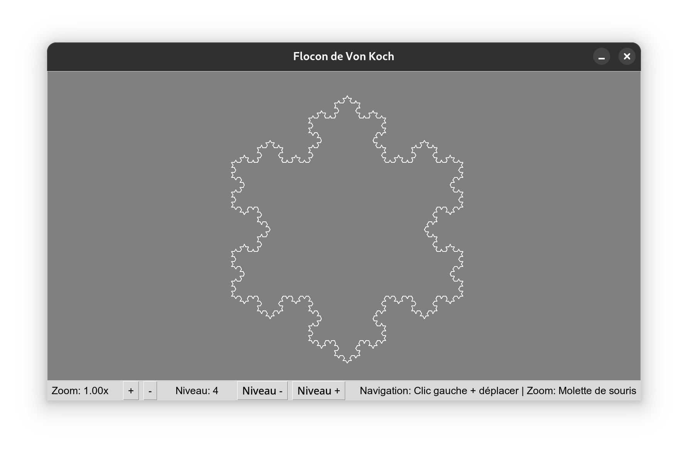

# 🌟 Flocon de Von Koch

Une application interactive permettant de visualiser et manipuler cette célèbre figure fractale. Découvrez la beauté mathématique des fractales à travers une interface simple et intuitive !



## 🔍 Caractéristiques

- ❄️ Génération d'un flocon de Von Koch avec niveau de récursion configurable
- 🔍 Zoom avant/arrière fluide (molette de souris ou boutons +/-)
- 🖱️ Navigation intuitive dans la vue (glisser-déposer)
- 🔄 Modification du niveau de récursion en temps réel
- 🖥️ Compatible avec Windows, macOS et Linux

## 🧮 Qu'est-ce que le flocon de Von Koch ?

Le flocon de Von Koch est une figure fractale construite en remplaçant récursivement chaque segment d'un triangle équilatéral par quatre segments formant une pointe. Cette structure mathématique fascinante présente la propriété d'avoir un périmètre infini tout en délimitant une aire finie !

## 🚀 Installation

1. Assurez-vous d'avoir Python 3.x installé sur votre système
2. Clonez ce dépôt :
   ```
   git clone https://github.com/RobinHil/py-von-koch-flake.git
   ```
3. Accédez au répertoire du projet :
   ```
   cd py-von-koch-flake
   ```
4. Lancez l'application :
   ```
   python von_koch.py
   ```

## 💻 Utilisation

- **Zoom** : Utilisez la molette de la souris ou les boutons +/- en bas de l'écran
- **Déplacement** : Cliquez et faites glisser la souris pour vous déplacer dans la vue
- **Niveau de récursion** : Ajustez le niveau de détail avec les boutons "Niveau +" et "Niveau -"
  - Un niveau plus élevé = plus de détails (mais aussi plus de calculs)
  - Recommandation : niveau 0-6 pour des performances optimales

## 🔧 Personnalisation

Vous pouvez facilement modifier les paramètres par défaut en ajustant les constantes dans la classe `VonKochApp` :

```python
class VonKochApp:
    TAILLE_FLOCON = 600
    NIVEAU_RECURSION = 4
```
